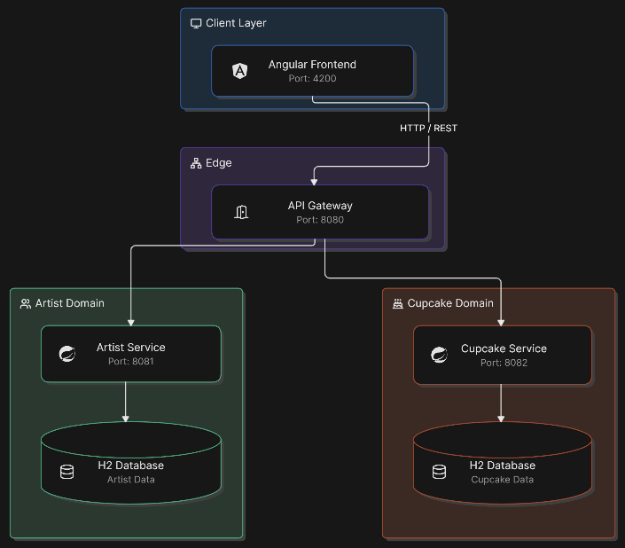
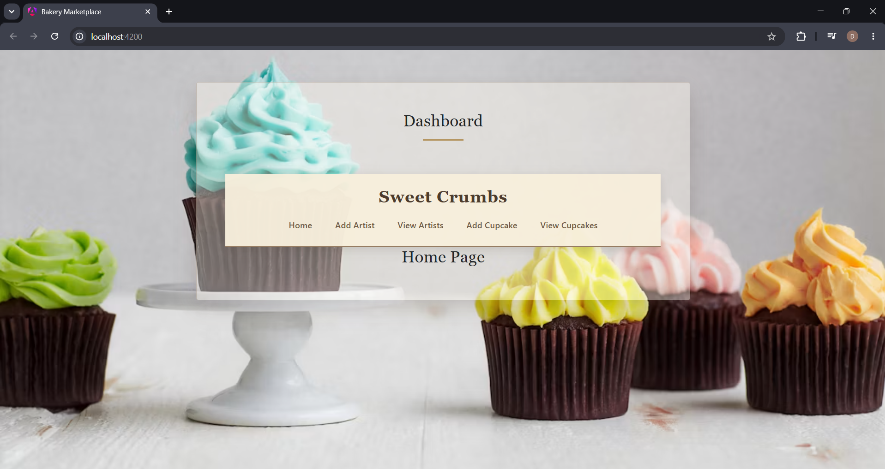
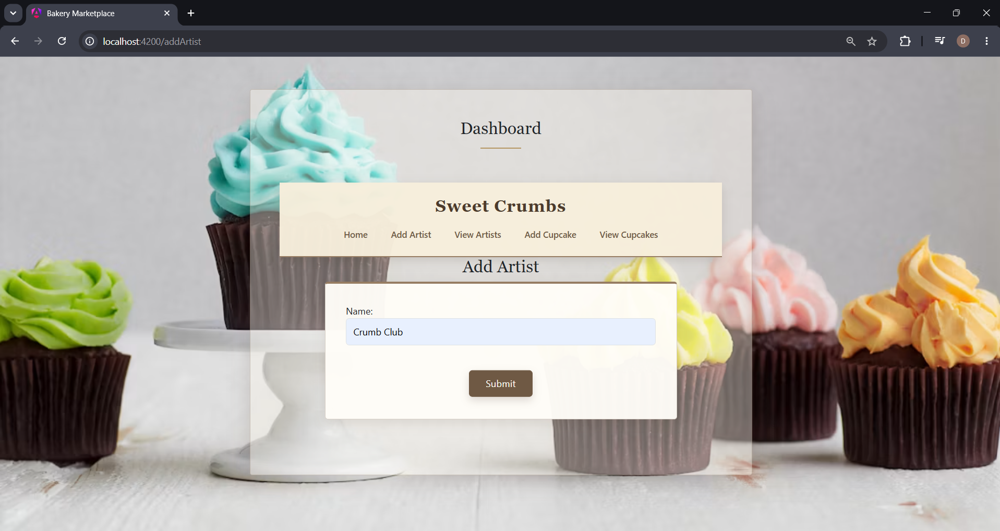
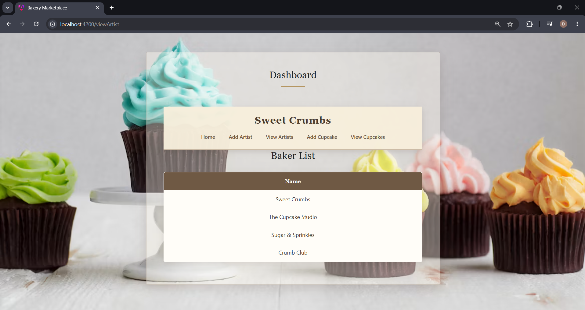
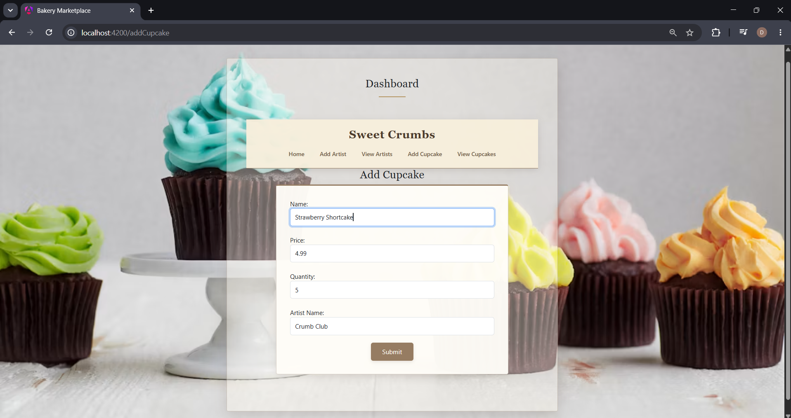
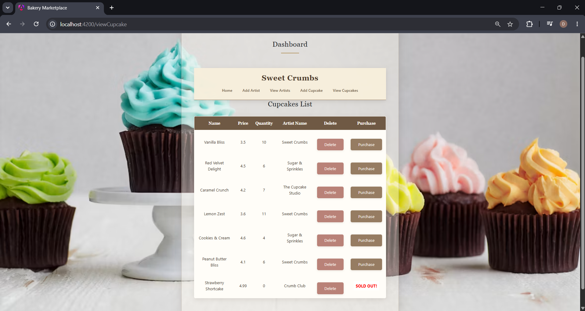
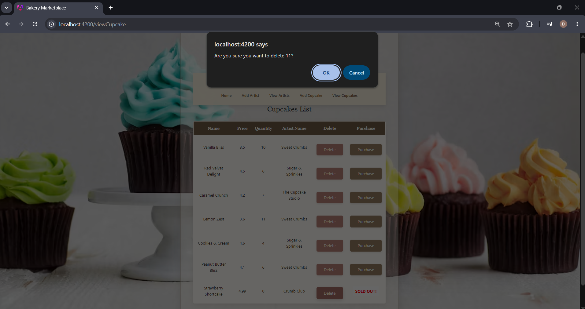
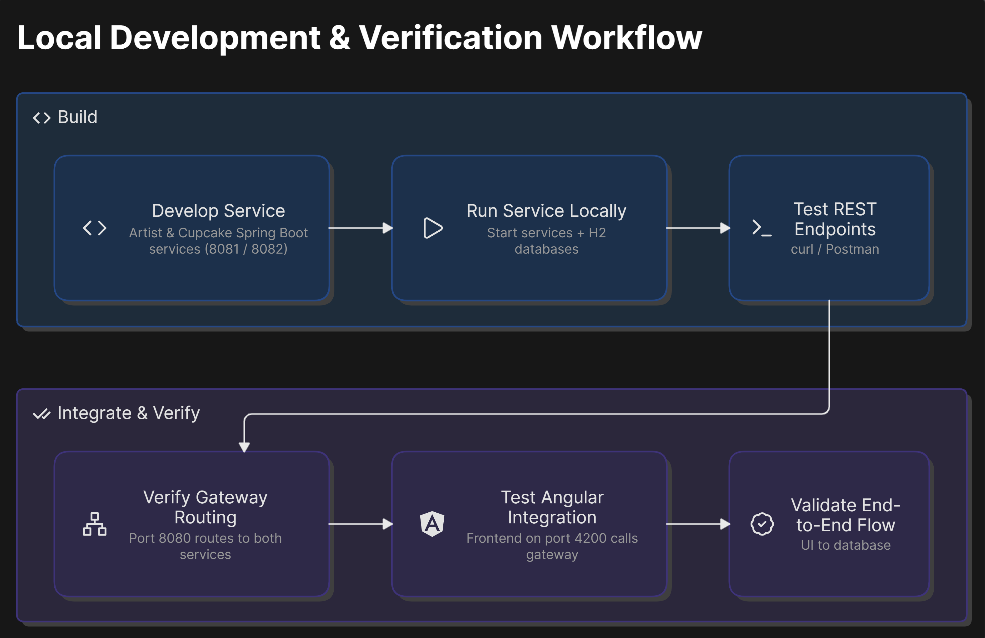

# Bakery Marketplace

Bakery Marketplace is a full-stack microservices application built with Spring Boot and Angular. The application provides a digital marketplace where artists and bakers can create and manage cupcake listings, associate products with artists, track inventory, and process cupcake purchases.

The project demonstrates a service-oriented backend architecture consisting of independent Spring Boot services, an API Gateway for centralized request routing, and an Angular frontend that communicates with the backend through REST APIs.

The application was developed to gain practical experience with microservices architecture, RESTful API development, service separation, API Gateway patterns, frontend-backend integration, database management, and business logic implementation.

---

## Project Overview

Bakery Marketplace is structured as a multi-service full-stack application composed of three Spring Boot backend applications and one Angular frontend application.

The backend is divided into separate services based on business responsibilities:

* Artist Service manages artist and baker records
* Cupcake Service manages cupcake listings, inventory, and purchasing
* API Gateway provides centralized request routing between the frontend and backend services
* Angular Frontend provides the user interface for interacting with the marketplace

The frontend communicates with the API Gateway rather than directly connecting to individual backend services. This approach provides a centralized entry point for API requests and reduces coupling between the frontend and individual microservice implementations.

Each backend service maintains its own H2 in-memory database, providing independent data ownership between services.

---

## Key Features

### Artist Management

* Create new artists and bakers
* View registered artists
* Associate cupcake listings with individual artists
* Manage artist-related information through REST APIs

### Cupcake Management

* Create cupcake listings
* View available cupcakes
* Display cupcake pricing and inventory
* Associate cupcakes with artists
* Delete cupcake listings
* Manage cupcake availability

### Purchase and Inventory Management

* Purchase available cupcakes
* Automatically decrease cupcake inventory after a purchase
* Prevent further purchases when inventory reaches zero
* Display a sold-out state when a cupcake is no longer available

### API Gateway

* Provides a centralized entry point for frontend API requests
* Routes requests to the appropriate backend microservice
* Separates frontend communication from individual service implementations
* Simplifies communication between the Angular frontend and backend services

### Angular Frontend

* Single-page application architecture
* Component-based frontend development
* REST API integration
* User interface for artist management
* User interface for cupcake management
* Purchase and inventory interaction
* Marketplace-oriented application flow

---

## Technologies Used

### Backend

* Java 21
* Spring Boot
* Spring Data JPA
* Hibernate
* REST APIs
* H2 Database
* Maven

### Frontend

* Angular
* TypeScript
* RxJS
* Angular Standalone Components

### Development Tools

* IntelliJ IDEA
* Angular CLI
* Maven
* Git
* GitHub

---

## System Architecture

The application follows a microservices-based architecture where individual backend services are responsible for separate business domains.



### Request Flow

```text
Angular Frontend
       |
       v
   API Gateway
       |
       +--------------------+
       |                    |
       v                    v
Artist Service       Cupcake Service
       |                    |
       v                    v
 H2 Database           H2 Database
```

The Angular frontend sends requests through the API Gateway. The gateway determines which backend service should handle each request and forwards the request accordingly.

The Artist Service is responsible for artist-related functionality, while the Cupcake Service manages cupcake listings, inventory, and purchase-related business logic.

The backend services maintain separate data stores, supporting clear service boundaries and independent ownership of application data.

---

## Microservice Responsibilities

| Service          |   Port | Responsibility                             |
| ---------------- | -----: | ------------------------------------------ |
| Artist Service   | `8081` | Artist and baker management                |
| Cupcake Service  | `8082` | Cupcake listings, inventory, and purchases |
| API Gateway      | `8080` | Centralized API routing                    |
| Angular Frontend | `4200` | User interface and client-side application |

---

## Project Architecture

The project follows a modular structure in which each service is maintained as an independent application within the same repository.

```text
bakery-marketplace/
|
+-- artist-service/
|   +-- src/
|   +-- pom.xml
|   +-- ...
|
+-- cupcake-service/
|   +-- src/
|   +-- pom.xml
|   +-- ...
|
+-- api-gateway/
|   +-- src/
|   +-- pom.xml
|   +-- ...
|
+-- frontend/
|   +-- src/
|   +-- public/
|   +-- package.json
|   +-- angular.json
|   +-- ...
|
+-- screenshots/
|   +-- 01-home.png
|   +-- 02-add-artist.png
|   +-- 03-artists.png
|   +-- 04-add-cupcake.png
|   +-- 05-cupcakes.png
|   +-- 06-purchase.png
|   +-- 07-sold-out.png
|   +-- architecture.png
|
+-- .gitignore
+-- README.md
```

---

## Backend Services

### Artist Service

The Artist Service is responsible for managing artist and baker information.

Its primary responsibilities include:

* Creating artist records
* Retrieving artist information
* Managing artist-related data
* Providing REST endpoints for artist operations

The service operates independently from the Cupcake Service and maintains its own H2 database.

---

### Cupcake Service

The Cupcake Service manages the marketplace's cupcake-related functionality.

Its primary responsibilities include:

* Creating cupcake listings
* Retrieving cupcake listings
* Managing cupcake inventory
* Processing cupcake purchases
* Updating available quantities
* Identifying sold-out products
* Deleting cupcake listings

The service maintains its own H2 database and contains the business logic related to cupcake inventory and purchasing.

---

### API Gateway

The API Gateway acts as the centralized entry point for frontend requests.

Instead of the Angular frontend communicating directly with multiple backend services, requests are sent through the gateway and routed to the appropriate service.

This architecture provides:

* Centralized request routing
* Reduced frontend-to-service coupling
* Clear separation between frontend and backend services
* A single backend entry point for the client application

---

### Angular Frontend

The Angular application provides the user-facing interface for the marketplace.

The frontend communicates with the backend through REST API requests routed through the API Gateway.

The application provides functionality for:

* Viewing artists
* Adding artists
* Viewing cupcake listings
* Adding cupcakes
* Purchasing cupcakes
* Viewing inventory changes
* Identifying sold-out cupcakes
* Managing marketplace interactions

---

## Database Architecture

The application uses H2 in-memory databases for local development and demonstration purposes.

Each backend service maintains its own database.

```text
Artist Service
      |
      v
H2 Database
Artist Data


Cupcake Service
      |
      v
H2 Database
Cupcake Data
```

This approach demonstrates the concept of independent data ownership in a microservices architecture.

The services do not rely on a single shared database for their core operations.

---

## Object and Service Relationships

The application manages a relationship between artists and cupcake listings.

Conceptually, the relationship can be represented as:

```text
Artist
   |
   | Artist ID
   |
   v
Cupcake Listing
   |
   +-- Name
   +-- Price
   +-- Quantity
   +-- Artist Reference
```

Cupcake listings reference their associated artist through an identifier. This allows the services to maintain separate data ownership while still representing relationships between application domains.

---

## Purchase and Inventory Flow

The cupcake purchasing process follows a simple inventory management workflow.

```text
User Views Cupcake
        |
        v
Check Available Quantity
        |
        v
Quantity > 0 ?
    /         \
  Yes          No
   |            |
   v            v
Purchase      Sold Out
   |
   v
Decrease Quantity
   |
   v
Update Cupcake
   |
   v
Display Updated Inventory
```

When a cupcake is purchased, the available quantity is decreased.

When the quantity reaches zero, the cupcake is displayed as sold out and is no longer available for purchase.

---

## API Endpoints

The application exposes REST endpoints through the API Gateway.

### Artist Endpoints

| Method | Endpoint          | Description          |
| ------ | ----------------- | -------------------- |
| `GET`  | `/api/v1/artists` | Retrieve all artists |
| `POST` | `/api/v1/artists` | Create a new artist  |

### Cupcake Endpoints

| Method   | Endpoint                | Description                          |
| -------- | ----------------------- | ------------------------------------ |
| `GET`    | `/api/v1/cupcakes`      | Retrieve all cupcakes                |
| `POST`   | `/api/v1/cupcakes`      | Create a new cupcake                 |
| `PUT`    | `/api/v1/cupcakes/{id}` | Update or process a cupcake purchase |
| `DELETE` | `/api/v1/cupcakes/{id}` | Delete a cupcake                     |

All frontend requests are intended to be routed through the API Gateway.

The exact endpoint paths and HTTP methods should correspond to the current implementation of each service.

---

## Screenshots

### System Architecture


### Home Page



### Add Artist



### Artists List



### Add Cupcake



### Cupcake Marketplace


### Purchase Flow


### Sold Out State



### Delete



---

## Build and Run

### Prerequisites

Before running the application, ensure the following software is installed:

* Java 21 or later
* Maven
* Node.js
* npm
* Angular CLI
* Git

Verify the installed versions:

```bash
java -version
mvn -version
node -v
npm -v
ng version
```

---

## Clone the Repository

Clone the repository from GitHub:

```bash
git clone https://github.com/dhruvi-mnv/bakery-marketplace.git
```

Navigate into the project directory:

```bash
cd bakery-marketplace
```

---

## Run the Artist Service

Open a terminal and navigate to the Artist Service:

```bash
cd artist-service
```

Run the Spring Boot application:

```bash
./mvnw spring-boot:run
```

On Windows:

```bash
mvnw.cmd spring-boot:run
```

The Artist Service runs on:

```text
http://localhost:8081
```

---

## Run the Cupcake Service

Open a second terminal and navigate to the Cupcake Service:

```bash
cd cupcake-service
```

Run the Spring Boot application:

```bash
./mvnw spring-boot:run
```

On Windows:

```bash
mvnw.cmd spring-boot:run
```

The Cupcake Service runs on:

```text
http://localhost:8082
```

---

## Run the API Gateway

Open a third terminal and navigate to the API Gateway:

```bash
cd api-gateway
```

Run the Spring Boot application:

```bash
./mvnw spring-boot:run
```

On Windows:

```bash
mvnw.cmd spring-boot:run
```

The API Gateway runs on:

```text
http://localhost:8080
```

---

## Run the Angular Frontend

Open a fourth terminal and navigate to the frontend:

```bash
cd frontend
```

Install the required dependencies:

```bash
npm install
```

Start the Angular development server:

```bash
npm start
```

Alternatively:

```bash
ng serve
```

The Angular frontend runs on:

```text
http://localhost:4200
```

Open the application in a browser:

```text
http://localhost:4200
```

---

## Running the Complete Application

The application requires all four components to be running:

```text
Terminal 1
Artist Service
Port 8081

Terminal 2
Cupcake Service
Port 8082

Terminal 3
API Gateway
Port 8080

Terminal 4
Angular Frontend
Port 4200
```

The recommended startup sequence is:

```text
1. Start Artist Service
          |
          v
2. Start Cupcake Service
          |
          v
3. Start API Gateway
          |
          v
4. Start Angular Frontend
          |
          v
5. Open http://localhost:4200
```

---

## Technical Highlights

### Microservices Architecture

The backend is divided into independent services based on business responsibilities. This approach improves separation of concerns and allows each service to be developed and maintained independently.

### API Gateway Pattern

The API Gateway provides a centralized entry point for frontend requests and routes each request to the appropriate backend service.

This prevents the frontend from being tightly coupled to the internal structure and ports of individual microservices.

### Independent Data Ownership

The Artist Service and Cupcake Service maintain separate H2 databases.

This demonstrates the concept of service-level data ownership and avoids relying on a single shared database for all application functionality.

### RESTful API Design

The backend services expose REST endpoints for creating, retrieving, updating, and deleting application data.

The Angular frontend consumes these APIs through the API Gateway.

### Inventory Management

The Cupcake Service implements business logic for managing available inventory.

Purchasing a cupcake decreases the available quantity, while a quantity of zero results in a sold-out state.

### Frontend and Backend Integration

The project demonstrates integration between an Angular single-page application and multiple Spring Boot backend services through an API Gateway.

---

## Challenges and Solutions

### Coordinating Multiple Backend Services

Running multiple Spring Boot applications requires clear separation of responsibilities, service configuration, and port management.

**Solution:** Each service was configured as an independent Spring Boot application with its own responsibilities and dedicated port. The API Gateway was used to centralize request routing.

### Managing Frontend-to-Backend Communication

Connecting an Angular frontend directly to multiple backend services can introduce unnecessary coupling between the frontend and backend architecture.

**Solution:** The API Gateway provides a single entry point for frontend communication and forwards requests to the appropriate backend service.

### Maintaining Independent Service Data

A microservices architecture requires services to maintain clear data boundaries.

**Solution:** The Artist Service and Cupcake Service use separate H2 databases, allowing each service to maintain ownership of its own domain data.

### Managing Cross-Service Relationships

Cupcake listings need to reference the artists associated with them while maintaining independent service boundaries.

**Solution:** Artist identifiers are used to associate cupcake listings with their corresponding artists without requiring a shared database.

### Migrating the Development Environment

The project was migrated from Eclipse to IntelliJ IDEA while preserving the existing Maven configuration and ensuring that the Spring Boot services and Angular frontend continued to operate together.

**Solution:** The Maven project configuration, application settings, frontend dependencies, and service configurations were reviewed and verified after migration.

---

## Development Workflow

The project follows a modular development workflow where each backend service and the frontend application can be developed independently.

The general development process is:



This structure makes it easier to extend the application by adding new services, functionality, or frontend components without placing all application logic into a single codebase.

---

## Future Improvements

Potential future improvements include:

* Replace H2 in-memory databases with PostgreSQL or MySQL
* Add persistent data storage
* Implement authentication and authorization using JWT
* Introduce role-based access control
* Add separate roles for artists, customers, and administrators
* Containerize individual services using Docker
* Add Docker Compose for local service orchestration
* Implement automated unit and integration testing
* Add pagination to marketplace listings
* Add search and filtering functionality
* Add sorting for cupcake listings
* Introduce centralized logging and monitoring
* Add service health monitoring
* Improve error handling and validation
* Deploy the application to a cloud platform
* Implement CI/CD pipelines for automated builds and deployments

---

## Learning Outcomes

This project provided practical experience in:

* Designing a microservices-based application
* Developing RESTful APIs using Spring Boot
* Separating application functionality into independent services
* Implementing API Gateway-based request routing
* Integrating Angular with Spring Boot backend services
* Working with Spring Data JPA and Hibernate
* Using H2 databases for service-level data management
* Implementing inventory and purchase business logic
* Managing multiple applications within a single repository
* Using Maven for Java application builds
* Migrating and managing projects using IntelliJ IDEA
* Working with Angular standalone components and TypeScript
* Structuring and documenting a multi-service full-stack application

---

## Project Highlights

* Developed a full-stack marketplace application using Spring Boot and Angular
* Designed a microservices-based backend with independent service responsibilities
* Implemented an API Gateway as a centralized entry point for backend communication
* Built separate Artist and Cupcake services
* Implemented RESTful APIs for application data management
* Integrated an Angular frontend with multiple Spring Boot services
* Implemented cupcake inventory and purchase functionality
* Added sold-out inventory handling
* Used independent H2 databases for backend services
* Organized the application as a structured multi-service repository
* Migrated the development environment from Eclipse to IntelliJ IDEA
* Documented the application architecture, setup process, API endpoints, and technical decisions

---

## Author

**Dhruvi Jariwala**

Software Development and Network Engineering Student

[GitHub]: (https://github.com/dhruvi-mnv/)

[LinkedIn]: https://www.linkedin.com/in/dhruvi-jariwala-53b9a828/

---

## Project Summary

**Architecture:** Microservices

**Backend:** Spring Boot

**Frontend:** Angular

**API Communication:** REST

**Gateway:** API Gateway

**Database:** H2

**ORM:** Spring Data JPA / Hibernate

**Build Tool:** Maven

**Languages:** Java / TypeScript

**Development Environment:** IntelliJ IDEA
